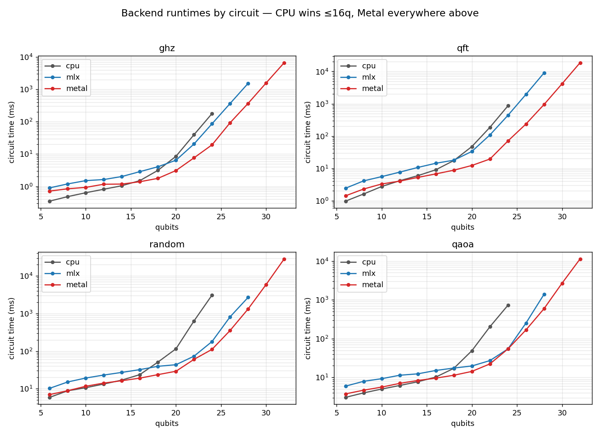
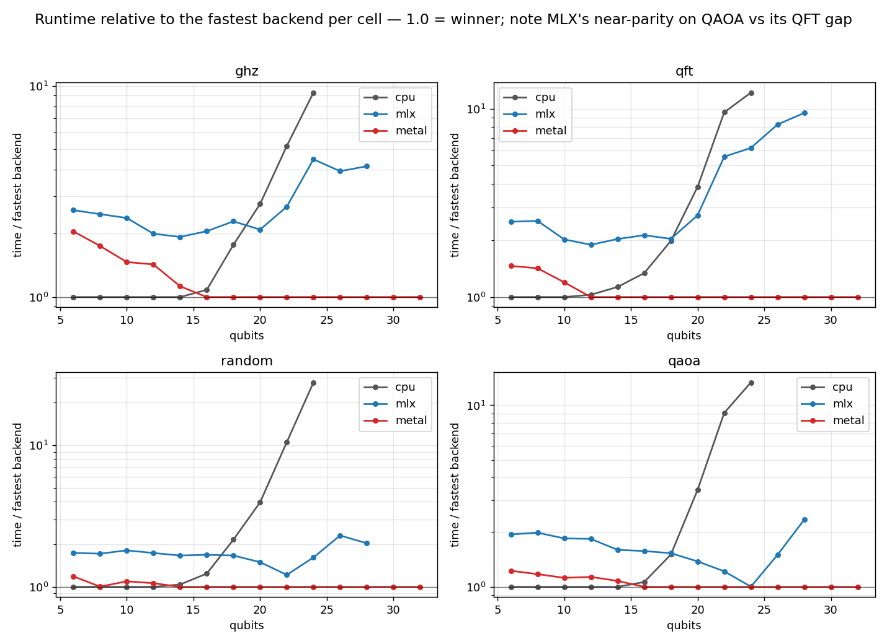
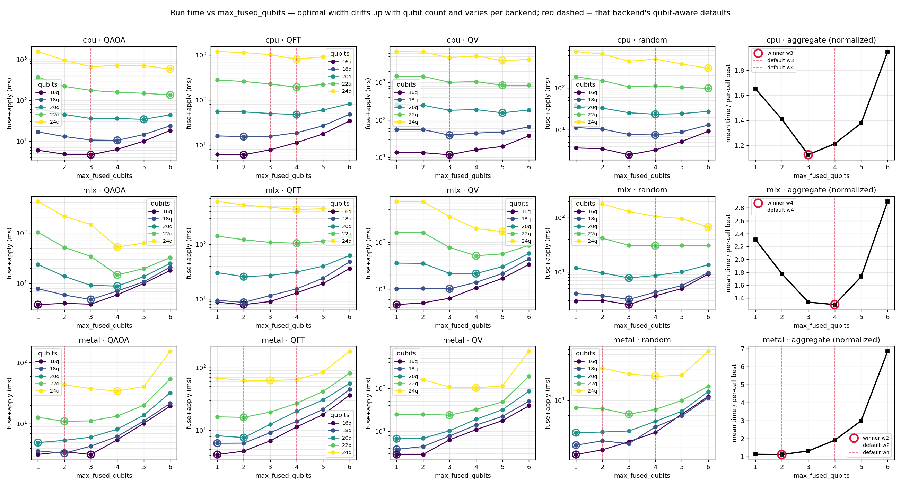

# Backends: CPU vs MLX vs Metal

macquerel ships three statevector backends. They produce identical results; they differ
in *where the amplitudes live* and *who applies the gates*, and that gives each one a
regime where it is the right choice. This page explains the regimes with measured data,
answers the two questions people ask most — *why is the GPU slower on small circuits?*
and *why does circuit structure change which GPU wins?* — and ends with tuning tips and
the optimization roadmap.

All numbers: Apple M5 Max, 128 GB, macOS, `complex64`, min of 3 reps,
subprocess-isolated cells (`benchmarks/data/large`, reproduce with
`benchmarks/bench_statevector.py`; charts via `benchmarks/plot_backends.py`).

## The three backends at a glance

| | CPU | MLX | Metal |
|---|---|---|---|
| Engine | NumPy (`tensordot` + in-place diagonal multiply) | [MLX](https://github.com/ml-explore/mlx) lazy compute graph | Custom Metal kernels via PyObjC |
| State storage | NumPy array | `mx.array` in unified memory, **double-buffered** per gate (~2× state size, plus lazy-graph temporaries) | One `MTLBuffer`, updated **in place** (1× state size) |
| Max qubits | ~24 practical | **30** (MLX's `int32` shape limit rejects ≥2³¹ amplitudes) | **33** (64-bit indexing; a 64 GiB state on a 128 GiB machine) |
| Wins at | **≤16q** | — (fallback for 17–30q when PyObjC-Metal is absent) | **≥17q** |
| Install | built in | `pip install "macquerel[mlx]"` | `pip install "macquerel[metal]"` |

`Simulator()` (the default, `backend="auto"`) routes by qubit count: CPU through 16q,
Metal from 17q up, MLX only as the 17–30q fallback when the Metal backend isn't
installed. These boundaries are measured, not guessed — the sections below show the
data behind them.

## Who wins where

Three regimes, visible in every panel:

- **≤16q — CPU.** The state is at most 0.5 MB; a gate is a cache-resident NumPy call.
  GPU dispatch overhead dominates anything the GPU could save (next section).
- **17–30q — Metal, with MLX a usable fallback.** The work per gate (a full pass over
  2ⁿ amplitudes) now dwarfs dispatch costs. Metal beats MLX at every measured count,
  by 1.2× (QAOA, 22q) up to 9.5× (QFT, 28q) depending on circuit structure — see
  [below](#circuit-structure-matters-why-qaoa-is-mlxs-best-circuit). Both beat CPU by
  a lot: at 24q Metal runs the random circuit **28× faster** (112 ms vs 3.1 s).
- **31q+ — Metal only.** MLX's `int32` shape element caps it at 30q; the Metal
  backend's 64-bit indexing and in-place updates carry on to 33q (a 64 GiB state),
  scaling at roughly 2× per added qubit — the bandwidth-bound ideal.

## Why Metal trails at low qubit counts

Below ~16q Metal is nominally slower than CPU — GHZ at 6q takes 0.72 ms on Metal vs
0.35 ms on CPU (and 0.90 ms on MLX). Nothing is wrong; the circuit just isn't big
enough to pay for the GPU's fixed costs:

- **Dispatch and synchronization latency.** Every `run()` must create a command
  buffer, encode the kernels, commit, and `waitUntilCompleted` at least once (at each
  observation boundary). Committing a command buffer and getting the GPU scheduled
  costs on the order of hundreds of microseconds *regardless of state size*. Gate
  batching (Step 22 of the performance line) already collapsed the per-**gate** sync
  into one sync per boundary — what remains is close to irreducible.
- **Per-gate encode cost.** Encoding a kernel dispatch (pipeline lookup, buffer
  bindings) costs a few microseconds per gate on the host. At 6q a NumPy gate apply on
  a 64-amplitude state costs about the same — so the GPU adds overhead without
  removing any.
- **The work is too small to parallelize.** A 6q state is 512 bytes. The GPU's
  thousands of threads cannot be fed; the CPU does the whole gate inside L1 cache.

The penalty is a *fixed* cost, so two things follow. First, it is largest on shallow
circuits and amortizes with depth: GHZ@6q (7 gates) pays 2× over CPU, while the
depth-50 random circuit at 6q pays only 1.19× (6.99 vs 5.89 ms). Second, it vanishes
as the state grows — gate work doubles per added qubit while the overhead stays
constant, and the lines cross at 12–16q depending on the circuit (see the relative
chart below). That measured crossover is exactly why auto-select keeps CPU through
15q: you get the best of both without thinking about it. (The boundary is a chip
property — `MACQUEREL_BACKEND_TIERS=auto` re-measures and caches it for *your*
chip, mirroring the fusion-width autotuner.)

## Circuit structure matters: why QAOA is MLX's best circuit

Relative to Metal, MLX's gap is wildly circuit-dependent: at 24q it is at **parity on
QAOA** (54.4 vs 54.3 ms — and 13× faster than CPU), 1.6× behind on random, and 6.2×
behind on QFT (438 vs 70 ms, growing to 9.5× at 28q). The fused gate stream explains
all three, because MLX's costs are dominated by *data movement around* each op while
Metal's specialized kernels are mostly insensitive to it:

- **QAOA fuses into few, contiguous ops.** The benchmark QAOA (3 layers of a CZ ring
  plus an RX layer, 144 gates at 24q) collapses under commutation-aware fusion into
  just **24 four-qubit groups on adjacent qubits** — `[0–3], [3–6], [6–9], …` — because
  its interactions are nearest-neighbor by construction. MLX applies a dense gate with
  `tensordot`, which internally permutes the state to bring the targeted axes together;
  for contiguous targets that data movement is cheap and the op runs at bandwidth,
  just like Metal's.
- **Random circuits fuse into scattered ops.** The same fusion gives the random
  circuit 13 groups, but on qubits like `[2, 12, 15, 23]` — the permutation is a
  full-state shuffle with poor locality, and MLX falls to 1.5–2.3× behind Metal,
  whose gather-style kernels degrade much less.
- **QFT is dominated by wide diagonal runs.** 376 controlled-phase gates fuse into
  ~38 diagonal ops of width 7–8 (plus 18 dense groups). Metal executes a diagonal
  with a dedicated in-place kernel — one read and one write per amplitude. MLX's
  diagonal path is a gather-plus-multiply into a fresh buffer (it cannot update in
  place), several times the memory traffic per op — and QFT has many such full-state
  ops, so the gap compounds with qubit count.

The same logic predicts MLX's weakest spots generally: many full-state ops, scattered
targets, or diagonal-heavy structure. It also yields a practical tip — if you control
circuit construction, **keeping two-qubit interactions on nearby qubit indices is free
performance**, on MLX especially but measurably on Metal too (QAOA's contiguous groups
cost ~2.3 ms each at 24q on Metal; random's scattered ones ~8.6 ms).

Past 24q Metal pulls ahead even on QAOA (1.5–2.35× at 26–28q): in-place updates move
half the bytes of MLX's double-buffering, and MLX additionally throttles its lazy graph
(`async_eval` every 16 gates at ≥24q) to keep its temporaries from swapping.

## Getting the best performance

1. **Leave `backend="auto"`.** The tiers (CPU ≤15q, Metal ≥16q) are measured on real
   circuits; forcing a GPU backend on a 10q circuit costs you 1.2–2×, and forcing CPU
   at 24q costs 10–28×. Install the Metal extra if you simulate beyond 15q — MLX is a
   fine fallback. (`MACQUEREL_BACKEND_TIERS=<int>` pins the boundary, `=auto`
   measures it once for your chip and caches it.)
2. **Stay in `complex64`** (the default) unless you genuinely need double precision:
   all backends are bandwidth-bound at scale, so `complex128` roughly halves
   throughput and doubles memory.
3. **Avoid mid-circuit observation.** Calling `statevector()` or expectation values
   forces the GPU to synchronize and flush (Metal commits its batched command buffer;
   MLX evaluates its lazy graph). Build the full circuit, then observe once.
4. **Mind the memory budget.** A state is 2ⁿ × 8 bytes (complex64): 8 GiB at 30q,
   32 GiB at 32q, 64 GiB at 33q. Measured peak footprints (`bench_memory.py`,
   `benchmarks/data/memory.png`): Metal sits *on* the theoretical line (32.2 GiB
   at 32q — genuinely in-place, +150 MB runtime baseline), the CPU backend peaks
   ~3× (tensordot copies), and MLX peaks up to ~20× on shallow circuits at 28q
   (double-buffering plus lazy-graph temporaries). If the working set approaches
   RAM, the OS swaps and runtimes fall off a cliff — that, not compute, is usually
   what a "slow" 28q+ run is. Density matrices double the qubit count: an n-qubit
   `DensityMatrixSimulator` run is a 2n-qubit state (4ⁿ × 8 bytes), so the same
   ceilings land at n=15 (MLX) and n=16 (Metal, 32 GiB) — the dashed series in
   the memory chart.
5. **Prefer nearest-neighbor structure** when you have the choice (see the QAOA
   section above).
6. **Fusion width is already tuned per backend** — metal fuses up to 2 qubits ≤22q,
   cpu 3 ≤18q, otherwise 4 — but two knobs exist: `MACQUEREL_FUSION_WIDTH=<int>` pins
   a global width, and `MACQUEREL_FUSION_WIDTH=auto` runs a small autotuner and caches
   the best width for *your* chip. (`MACQUEREL_DIAG_FUSION_WIDTH` separately controls
   the diagonal-run pass, default 8.) The chart below is the measurement behind the
   defaults; the red dashed lines mark what each backend uses.
7. **Shot sampling is autotuned too** — `Simulator(batch_shots="auto")` (the default)
   tunes the GPU sampling batch; an int pins it.

## Future optimizations

The five optimization candidates that came out of this comparison — batched
small-circuit simulation (`BatchedSimulator`, up to 47× on parameter sweeps), a
custom MLX dense kernel, the broadcast MLX diagonal path (qft@28 4.5×), lowering
Metal's small-n floor, and per-chip tier autotuning — have all **shipped** as
Steps 31–35; see [the completed plan](plan_completed.md) for commits and measured
A/B results. (The QFT/random numbers above predate that line: the MLX QFT gap
quoted here has since closed from 6.2×/9.5× to ~1.6×/2.2×.) Remaining work is the
v0.3 capacity line (noise channels, out-of-core states past 33q, multi-Mac
distribution over Thunderbolt) — see [the implementation plan](plan.md).
