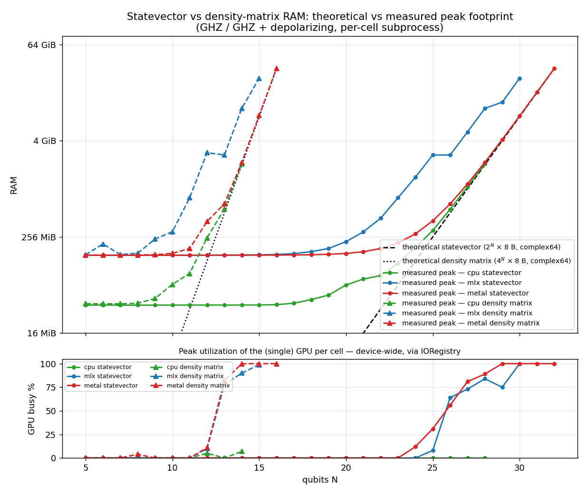

# The backends

All three backends implement the same small protocol:

```text
 allocate(n)            → state            (|0…0⟩, 2ⁿ complex64 amplitudes)
 apply_matrix(state, U, targets, controls) → state
 measure(state, qubits, collapse=…)        → outcomes      (projective)
 sample(state, qubits, shots)              → Counter       (Born-rule sampling)
 abs2sum / expectation_pauli / to_numpy    → host-side observations
```

They are differential-tested against each other to ~1e-5, so the choice never affects
*what* you compute — only how fast, and how many qubits fit. What actually differs is
**where the amplitudes live and who sweeps them**:

```text
              CPU                    MLX                      Metal
        ┌──────────────┐     ┌────────────────┐      ┌──────────────────┐
 state  │ NumPy array  │     │ mx.array in    │      │ one MTLBuffer in │
 lives  │ in RAM       │     │ unified memory │      │ unified memory   │
        └──────┬───────┘     └───────┬────────┘      └────────┬─────────┘
               │                     │                        │
 gates  CPU cores sweep it    GPU kernels from a       GPU kernels, encoded
 run    (chunked BLAS GEMM)   lazily-built graph       eagerly, in place
               │                     │                        │
 per    in place: chunk       out-of-place: every      in place: zero extra
 gate   scratch only          gate makes a new         copies (1× state,
        (~1.03× state)        buffer (~2× state)       measured)
               │                     │                        │
 ceiling  RAM & patience      30 qubits (int32         33 qubits (64 GiB,
          (~24q practical)    shape limit)             64-bit indexing)
```

This page explains each backend's design; the measured performance comparison and
tuning guidance live in [Backends: CPU vs MLX vs Metal](../backends.md).

## Backend selection

`Simulator()` (i.e. `backend="auto"`) routes by qubit count using measured crossover
points, not guesses:

```text
   n ≤ 15      → cpu     (state ≤ 0.25 MB: GPU dispatch latency would dominate)
   n ≥ 16      → metal   (if installed)
                 mlx     (fallback, up to its 30-qubit ceiling)
                 cpu     (last resort)
```

The boundary is a property of the chip; `MACQUEREL_BACKEND_TIERS=auto` re-measures
the CPU/GPU crossover once on *your* machine and caches it, and an integer value pins
it. The reasoning is a fixed-vs-scaling cost argument: GPU work per gate doubles with
every qubit while launch overhead stays constant, so there is always a crossover —
see [the performance page](../backends.md#why-metal-trails-at-low-qubit-counts) for
the measurement.

## CPU: the NumPy reference

`backends/cpu.py` is the semantic reference the GPU backends are tested against. A
dense gate transposes the `(2,)*n` view so the target axes lead (a stride trick, no
data movement), then sweeps the non-target axes in cache-sized chunks: gather a chunk
into contiguous scratch, one BLAS matmul, scatter the result back **to the same
positions** — safe in place because each group depends only on its own amplitudes,
the same argument that makes Metal's kernels race-free. Diagonal gates take a
broadcast in-place multiply instead (one read + one write per amplitude, no temporary
— required for the wide fused diagonals the compiler emits, where a 10-qubit diagonal
as a dense 1024×1024 matrix product would be slower than the gates it replaced).

The chunked in-place sweep replaced an `np.tensordot` contraction whose out-of-place
copies (internal permutation, output, write-back) peaked at ~3× the state; peak now
sits at ~1.03× (the measured multiplier in `benchmarks/data/memory.json` — a 28q GHZ
peaks at 2.05 GiB) and the chunked GEMM is also faster everywhere, up to 1.7× on
scattered-target circuits. Practical to ~24 qubits; beyond that it is GPU territory.

## MLX: a lazy compute graph on the GPU

[MLX](https://github.com/ml-explore/mlx) is Apple's machine-learning array framework.
Arrays live in unified memory and operations are **lazy**: `mx.multiply`, `mx.matmul`
etc. don't execute — they append nodes to a compute graph, which runs only when
something forces evaluation (`mx.eval`, or reading values back). For a circuit this
is a natural fit: the whole gate sequence becomes one graph that MLX's scheduler
fuses and executes in a handful of kernels, and nothing synchronizes with the host
until you ask for results.

```text
   h(0)      cx(0,1)     rz(1,θ)         statevector()
    │           │           │                  │
    ▼           ▼           ▼                  ▼
  [node] ──► [node] ──► [node] ──► … ──►  mx.eval(graph)
                (graph building: microseconds,        (GPU executes the
                 nothing runs yet)                     whole fused graph)
```

How the gate kinds map onto MLX (`backends/mlx_backend.py`):

- **Diagonal** — reshape the state so each target qubit gets its own length-2 axis
  (gaps between targets collapsed, so the view stays ≤ 2k+1 dimensional) and
  broadcast-multiply by the `(2,)*k` diagonal. One elementwise kernel, no index
  table.
- **Permutation** — a custom kernel with the dense path's one-thread-per-group
  design: each thread computes its group's 2ᵏ gather indices *in registers* and
  applies the per-row phases. The earlier implementation built the per-amplitude
  source index as full-width graph arrays (`mx.arange` + bitwise ops); those
  intermediates — ~5 GiB of uint32 per fused 4-qubit permutation at 28q — were the
  dominant term in MLX's peak memory and the lazy graph kept several alive at once.
  Gates wider than 6 qubits fall back to that gather path.
- **Dense** — a custom kernel written through `mx.fast.metal_kernel`, with the same
  one-thread-per-group design as the native Metal backend (the gate width is baked
  into the kernel source so the per-row loops unroll into registers). This replaced
  `mx.tensordot`, whose internal permutation of the state was the dominant cost on
  scattered-target circuits. Gates wider than 6 qubits (which fusion never emits)
  fall back to tensordot.

Two structural costs are inherent to the design. First, MLX arrays are immutable, so
**every gate writes a fresh buffer** — the state is effectively double-buffered, and
a long lazy graph can keep many full-width intermediates alive. The backend bounds
this three ways: it calls `mx.async_eval` every 16 gates (every 2 above 26 effective
qubits) so MLX retires and frees earlier intermediates; because `async_eval` never
blocks — a shallow circuit can encode its *entire* graph before the GPU retires
anything — it keeps at most two checkpoints in flight, waiting on the previous one
before issuing the next; and observation boundaries return MLX's buffer pool to the
OS when it exceeds an eighth of unified memory. Together these hold peak memory to
~3–5× the state (down from ~20× before this line of work) — enough to run 29–30
qubit statevectors without swap. Second, MLX's shape elements are `int32`, so an
array of 2³¹ elements is rejected outright: **30 qubits is a hard ceiling**, and the
reason the native Metal backend exists.

One more trick worth knowing about because it shows up in the code as `MLXState.perm`:
after the wide-gate tensordot fallback the contracted axes land in *front* of the
output rather than back in their original positions. Restoring them costs a full transpose (a copy), so
the backend doesn't — it records the axis permutation on the state object and folds
it in once, at the next readback. Bookkeeping instead of bandwidth.

## Metal: in-place kernels, 64-bit indexing

`backends/metal_backend.py` drives the GPU directly through
[Metal](https://developer.apple.com/documentation/metal) (via PyObjC), with shader
source compiled at runtime — no offline toolchain, the package stays pure Python.
It exists for what MLX structurally cannot do:

- **64-bit indexing.** All index math in the kernels is `ulong`; states of 2³¹+
  amplitudes are fine. With in-place updates, a 33-qubit state is one 64 GiB buffer —
  it fits a 128 GiB machine.
- **Genuine in-place updates.** Each thread owns one group (the 2ᵏ amplitudes sharing
  its non-target bits — disjoint by construction, so there are no races): read the
  group, multiply, write back to the same locations. Measured peak memory sits *on*
  the theoretical 2ⁿ×8-byte line. Halving the bytes moved per gate relative to a
  double-buffered design is also a speed win in a bandwidth-bound regime.

The state is a single `MTLBuffer` of `float2` (bit-identical to NumPy `complex64`),
in unified memory with shared storage mode — so host readback is a **zero-copy
`np.frombuffer` view**, and `measure`/`sample` can reuse the CPU implementations on
that view directly. Three kernels mirror the gate kinds: `diagonal` (one thread per
amplitude), `monomial` (gather + phase per group), `dense` (matrix–vector per group,
controls checked with an early-out).

The driver layer is where Metal's overheads get engineered away:

```text
  apply_matrix calls          one open command buffer            GPU
  ───────────────────         ───────────────────────────       ─────
  h(0)      ─ encode ──►  ┌─────────────────────────────┐
  cx(0,1)   ─ encode ──►  │ dispatch │ dispatch │ … (≤256)│ ──► executes in
  rz(1,θ)   ─ encode ──►  └─────────────────────────────┘      encoding order
  …                                   │
  statevector()  ── flush: commit + waitUntilCompleted ─┘
                    (the only CPU↔GPU sync point)
```

- **Batched command encoding** — gate dispatches are encoded into one open command
  buffer and only committed at *observation boundaries* (readback, measure, sample)
  or every 256 dispatches. A run of gates pays one commit and one sync instead of one
  each; a serial encoder guarantees execution in encoding order, so no barriers are
  needed.
- **Per-width specialized pipelines** — the gate width `k` is baked into the shader
  as a preprocessor macro, so the compiler unrolls every per-row loop and sizes the
  per-thread arrays exactly; pipelines are cached per (kernel, k).
- **Shared process-wide objects** — device, queue, compiled libraries, and pipelines
  are module-level singletons: creating them cost ~7.5 ms per `Simulator` call in
  auto mode, now paid once per process.
- **Buffer pooling and constant caching** — state buffers are recycled on a free
  list (re-touching warm pages beats faulting fresh ones), small constant buffers
  (gate matrices, index tables) are cached by content, and redundant
  per-dispatch buffer re-binds are skipped.

The result is a backend that is fastest *everywhere* ≥ 16 qubits, not just past
MLX's ceiling — see [the measurements](../backends.md#who-wins-where).

## How many GPUs? One — the question is how full it gets

A point worth making explicit, because "MLX vs Metal" can sound like different
hardware: **every simulation in this library runs on at most one GPU.** Apple Silicon
has a single integrated GPU on the same die as the CPU (the M5 Max benchmark machine:
40 GPU cores behind one unified-memory controller); there is no multi-GPU
configuration to enumerate. MLX and the Metal backend are two *software* paths to the
same physical device — `MTLCreateSystemDefaultDevice` returns the one GPU either way
— and the CPU backend never touches it at all.

What actually varies with qubit count is **occupancy**: how much of that one GPU a
dispatch can fill. A k-qubit gate launches one thread per group, 2ⁿ⁻ᵏ threads total,
and a GPU with thousands of ALUs needs *tens of thousands* of threads in flight to
hide memory latency:

```text
                 threads per dense-4 gate     one 40-core GPU
 n = 12               2⁸  =   256             starved — most cores idle, and the
                                              launch overhead dwarfs the work
 n = 20               2¹⁶ =  65 536           roughly at the latency-hiding knee
 n = 30               2²⁶ ≈  67 M             saturated — bandwidth-bound, the
                                              regime the backends are built for
```

This is the hardware face of the [small-n story](../backends.md#why-metal-trails-at-low-qubit-counts):
below ~16 qubits the GPU isn't slow, it's *empty*, and auto-select keeps those
circuits on the CPU. The memory benchmark measures this directly — while each cell
runs, it samples the GPU's device-wide busy-percent from the IORegistry (the same
counter Activity Monitor plots). The utilization panel of the chart below shows the
measured curve (GHZ cells, M5 Max):

- **cpu** cells never leave the idle baseline at any qubit count — the CPU backend
  genuinely uses no GPU;
- **metal** breaks from the baseline at 24–25 qubits (12%, 31%) and saturates from
  29 qubits;
- **mlx** breaks out at 26 qubits (64%) and pins the GPU at 100% from 30 qubits;
- **density-matrix** cells, being doubled states, get busy at tiny qubit counts:
  ~80% at n=13 (a 26-qubit state) and 100% from n=14 on Metal.

Busy-percent is a *duty cycle* over the whole cell (including Python startup and
encode time), so lower at the same qubit count means the same circuit finished with
less GPU work — which is why these breakout points sit later than they used to:
before the memory line of work, MLX left the baseline at 22 qubits and pinned the
GPU from 24, because its permutation path was moving ~20× the state in index
intermediates. Device-wide busy-percent is not a per-core occupancy probe, but on
an otherwise idle machine it cleanly separates "the GPU barely woke up" from "the
GPU is the bottleneck".



## Memory at a glance

Peak resident memory, measured by `benchmarks/bench_memory.py` against the
theoretical 2ⁿ×8-byte state (multipliers from `benchmarks/data/memory.json`):

```text
            theory      cpu        mlx        metal
 statevector 2ⁿ×8 B     ~1.03×     ~3–5×      ~1.0×  (in place)
 density mx  4ⁿ×8 B     ~1.03×     ~3–5×      ~1.0×
```

Both non-Metal multipliers used to be far worse and fell to these values in the
v0.3.x RAM line (commits and A/B data in [the completed plan](../plan_completed.md)):
CPU's tensordot copies (~3×) became the in-place chunked sweep, and MLX's ~20× of
permutation-index intermediates became the register-resident kernel plus eval
backpressure described above — which is also what un-blocked MLX's 29–30q
statevectors and 15-qubit density matrices. What remains of the MLX multiplier is
the lazy graph's double-buffering and pool. When a working set approaches physical RAM,
macOS starts swapping and runtimes fall off a cliff — the memory benchmark
budget-gates its cells for exactly this reason, and it is usually what a "slow" 28q+
run turns out to be.

---

Next: [Optimizations](optimizations.md) — the compiler passes and tuning machinery
that sit on top of these three engines.
