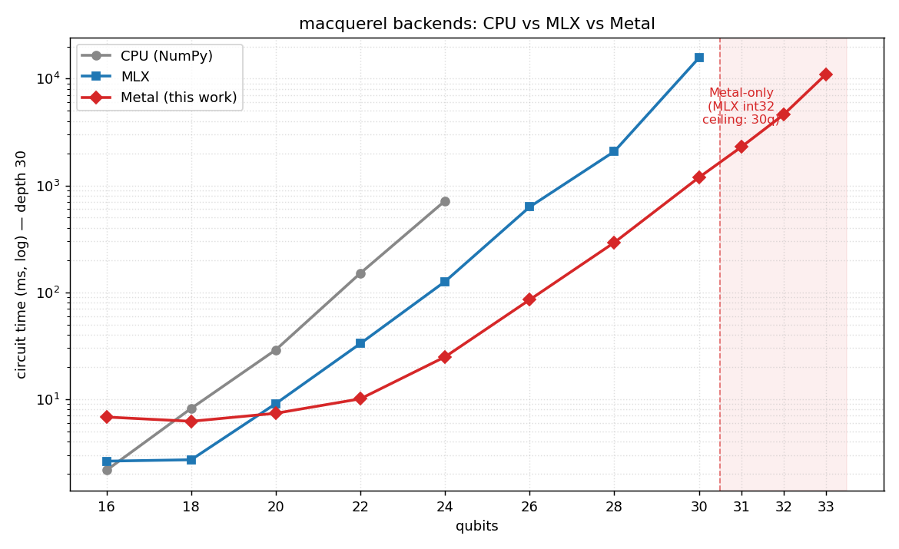

# macquerel

<p align="center">
  
</p>

A quantum state-vector simulator targeting Apple Silicon's unified-memory architecture.

## Install

```sh
pip install macquerel          # CPU backend
pip install "macquerel[mlx]"   # + Apple Silicon GPU backend
```

## Quickstart

```python
from macquerel import Circuit, Simulator

circuit = Circuit(2)
circuit.h(0).cx(0, 1).measure_all()

sim = Simulator()                  # auto-selects a backend
counts = sim.run(circuit, shots=1000)
print(counts)  # Counter({'00': ~500, '11': ~500})
```

## Backends

| Backend | Range | Notes |
|---|---|---|
| CPU (NumPy) | ≤16q | Reference implementation |
| MLX | 17–30q | Apple Silicon GPU |
| Metal | 31–33q | PyObjC driver, 64-bit indexing, in-place |

`Simulator()` selects automatically by qubit count; pass `backend="cpu" / "mlx" / "metal"`
to force one.



*Circuit time (depth-30 random circuit, log scale) on an Apple M5 Max. The shaded
region past 30 qubits is reachable only by the Metal backend.*

Each backend wins a different regime:

- **CPU (NumPy)** — the portable reference. Fastest at **≤16q**, where the state
  vector is only a few MB and per-gate GPU dispatch latency would dominate. Time and
  memory become impractical beyond ~24q. *Pro:* runs anywhere, no GPU. *Con:* doesn't
  scale.
- **MLX** — Apple Silicon GPU via a fused lazy graph. Wins **17–30q**, up to **~5.8×
  faster than CPU** at 22q. *Pro:* excellent mid-range throughput with little code.
  *Cons:* double-buffers every gate (≈2× memory), and its `int32` indexing hard-caps
  it at **30 qubits** (2³¹ amplitudes).
- **Metal** — custom PyObjC kernels with 64-bit indexing and genuine in-place updates.
  The **only** backend past 30q, reaching **31–33q** (16/32/64 GiB states). At
  overlapping sizes it also pulls ahead of MLX from ~22q up — **~13× faster at 30q** —
  and scales cleanly at ~2× per added qubit (bandwidth-bound ideal). *Pro:* capacity and
  large-n speed. *Con:* synchronises per gate, so below ~20q it's slower than both CPU
  and MLX — which is why auto-select still routes small circuits elsewhere.
