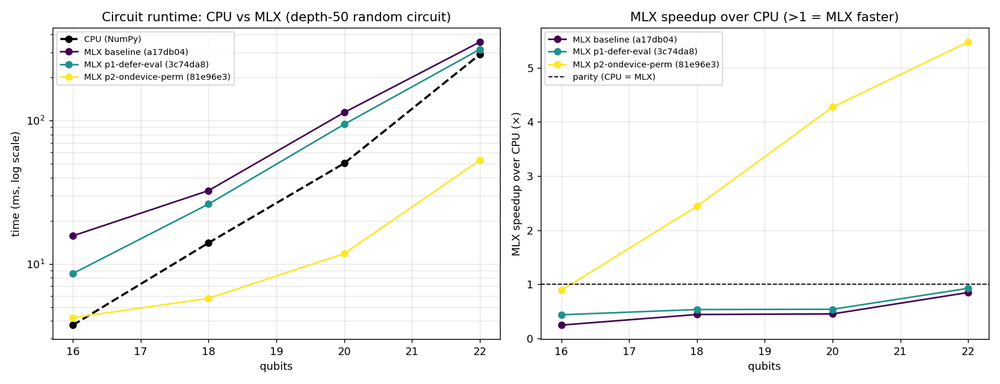

# macquerel benchmarks

Benchmarks live in `tests/benchmarks/` and are run manually — they are not part of the pytest suite.

## Running the benchmark

```bash
# default: qubit counts 10–24, depth 50, 3 reps
uv run python tests/benchmarks/bench_backends.py

# custom qubit range and depth
uv run python tests/benchmarks/bench_backends.py --qubits 10 14 18 22 26 --depth 30

# more reps for a more stable minimum (slower)
uv run python tests/benchmarks/bench_backends.py --reps 10
```

Each configuration runs `--reps` times; the **minimum** time is reported (best-case throughput, unaffected by OS scheduling noise).

### All options

| Flag | Default | Description |
|---|---|---|
| `--qubits N [N ...]` | `10 14 16 18 20 22 24` | Qubit counts to sweep |
| `--depth N` | `50` | Gates per circuit |
| `--reps N` | `3` | Repetitions; minimum time reported |
| `--seed N` | `42` | RNG seed — same seed produces identical circuits across runs |
| `--json FILE` | — | Write results to a JSON file |
| `--no-chart` | — | Suppress ASCII bar chart |

## Saving and comparing runs

Save results to JSON to compare across backend versions, machine configs, or code changes:

```bash
uv run python tests/benchmarks/bench_backends.py --json results/before.json
# ... make changes ...
uv run python tests/benchmarks/bench_backends.py --json results/after.json
```

Compare two runs directly in Python:

```python
import json

before = json.load(open("results/before.json"))["results"]
after  = json.load(open("results/after.json"))["results"]

print(f"{'qubits':>6}  {'before (ms)':>12}  {'after (ms)':>11}  {'delta':>8}")
for b, a in zip(before, after):
    delta = (a["cpu_ms"] - b["cpu_ms"]) / b["cpu_ms"] * 100
    print(f"{b['n_qubits']:>6}  {b['cpu_ms']:>12.1f}  {a['cpu_ms']:>11.1f}  {delta:>+7.1f}%")
```

## Plotting results

The repository tracks per-commit benchmark runs as JSON in `benchmarks/data/`,
named `<commit>-<label>.json`, and ships a plotting script that turns them into
a two-panel comparison chart.

Install the plotting dependency (matplotlib) once via the `viz` extra:

```bash
uv sync --extra viz
```

Generate a benchmark run labeled by the current commit, then plot every run in
the directory:

```bash
# 1. save a run keyed to the current commit
CID=$(git rev-parse --short HEAD)
uv run python tests/benchmarks/bench_backends.py \
    --qubits 16 18 20 22 --depth 50 --reps 3 \
    --json benchmarks/data/${CID}-mychange.json --no-chart

# 2. render benchmarks/data/benchmark.png
uv run python benchmarks/plot_results.py
```

`benchmarks/plot_results.py` auto-discovers every `*.json` in `benchmarks/data/`,
orders the curves slowest→fastest so the color ramp tracks the optimization
sequence, and labels each line with its commit hash. The output has two panels:

- **Runtime (log scale)** — CPU reference vs each MLX run.
- **Speedup over CPU** — `cpu_ms / mlx_ms`; above the parity line means MLX is faster.

Drop a new JSON in `benchmarks/data/` and re-run the script to add the next curve.



## Interpreting results

**MLX now beats CPU above ~16 qubits.** After the performance work in
`docs/plan.md` (P1: defer evaluation across gates; P2: build the permutation
gather index on-device), the MLX backend keeps state in MLX arrays across gate
calls and avoids per-gate host work and synchronization. On a depth-50 random
circuit MLX is roughly **2.4× faster at 18q, 4.3× at 20q, and 5.5× at 22q**.

**Why CPU still wins at small qubit counts:** at ≤16 qubits the state vector is
only a few MB, so per-kernel GPU dispatch latency dominates the actual compute
and NumPy is faster. The crossover sits just above 16 qubits; below it the
simulator's `auto` backend selection should prefer CPU.

**Further gains** are tracked as steps P3–P8 in `docs/plan.md` (cache device
constants, avoid the dense-path transpose copy, fuse on the hot path, re-tune
the auto-select crossover, `mx.compile`, native complex64 storage).
